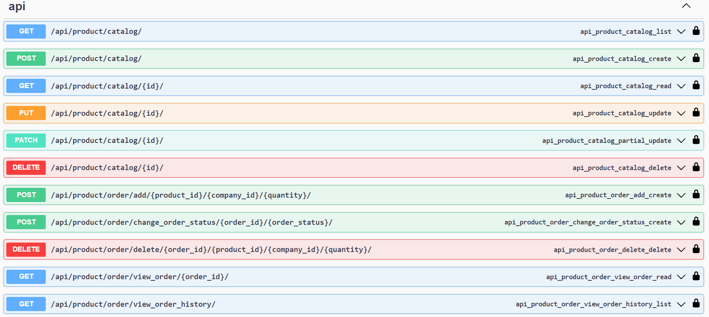
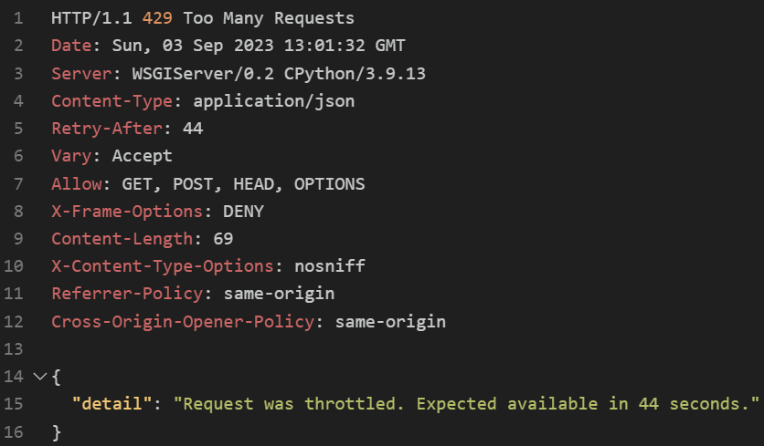

Резюме работы по замечаниям:
1. Интеграция в проект фреймворка Celery 

2. VeiwSets и роутеры. 
   Что сделано:
       - Добавлен ProductViewSet для вывода списка продуктов (каталога)
         и карточки отдельного продукта.
       - В urls.py зарегистрирован роутер и подключен маршрут: 
         path('product/', include(router.urls)). Данный маршрут отрабатывает
         запросы раздела 4.ПРОСМОТР КАТАЛОГА ПРОДУКТОВ

3. Покрыть хотя бы 30% модуля views.py тестами

4. Опробовать автогенерацию документации Open API в рамках пакета DRF-Spectacular.
   Что сделано:
       - Установлен пакет drf-yasg - Yet another Swagger generator, 
         приложение подключено в settings.py
       - В папку orders/orders/ добавлен файл yasg.py со схемой
       - В orders/orders/urls.py добавлены маршуты для swagger и redoc,
         определенные в yasg.py
       - Добавлены недостающие докстринги для классов и методов
    В результате по ссылке http://127.0.0.1:8000/swagger/ запускается интерфейс тестирования/документирования:

5. Попробовать простой DRF тротлинг. 
   Что сделано:
   В settings.py в раздел REST_FRAMEWORK добавлены настройки троттлинга:
        - 'DEFAULT_THROTTLE_CLASSES'
        - 'DEFAULT_THROTTLE_RATES': 
        'anon': '5/minute',
        'user': '10/minute'
    В результате при превышении кол-ва запросов системой выводится ответ:
    HTTP/1.1 429 Too Many Requests

6. Добавить возможность авторизации с 1-2 социальных сетей

7. Оптимизация запросов через django-silk